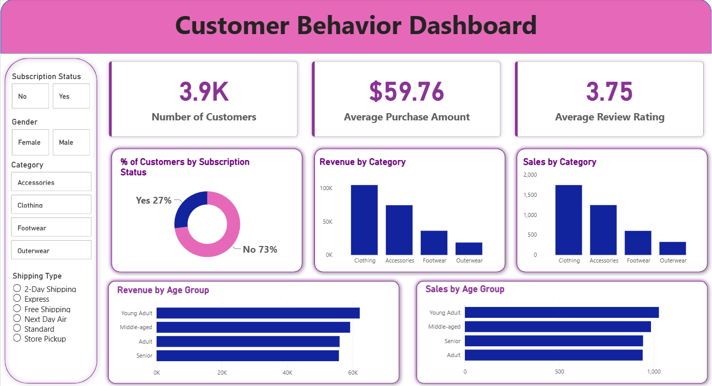

# 🛍️ RetailPulse — Customer Shopping Behavior Analytics

An end-to-end data analytics project that cleans, analyzes, and visualizes 3,900 real customer transactions to uncover **who buys what, why, and what keeps them coming back** — built with **Python, SQL, MySQL, and Power BI**.

> Raw transactional data → Python (cleaning + feature engineering) → MySQL (structured storage) → SQL (business-question queries) → Power BI (interactive dashboard) → actionable recommendations.

---

## 📌 Project Overview

Retailers sit on thousands of transaction rows that mean nothing on their own. This project turns 3,900 rows of raw shopping data into a decision-ready dashboard by answering 10 concrete business questions — from revenue splits and discount behavior to customer segmentation and loyalty patterns.

**Dataset:** 3,900 customer transactions across 18 features — demographics (age, gender, location), purchase details (item, category, amount, season, size, color), and shopping behavior (discounts, promo codes, previous purchases, purchase frequency, review rating, shipping type).

---

## 🧰 Tech Stack

| Stage | Tools |
|---|---|
| Data cleaning & feature engineering | Python (Pandas) |
| Database storage | MySQL |
| Business-question analysis | SQL (window functions, CTEs, subqueries) |
| Dashboard & visualization | Power BI (DAX, slicers, KPI cards) |

---

## 🔄 Workflow

1. **Load & explore** — imported the raw CSV with Pandas; checked structure (`df.info()`) and summary stats (`df.describe()`).
2. **Clean**
   - Imputed 37 missing `review_rating` values using the **median rating per product category**.
   - Standardized all column names to `snake_case`.
   - Verified `discount_applied` and `promo_code_used` were redundant → dropped `promo_code_used`.
3. **Feature engineer**
   - Built an `age_group` column by binning customer ages.
   - Built a `purchase_frequency_days` column from purchase-frequency text data.
4. **Load into MySQL** — pushed the cleaned DataFrame into a MySQL database for structured SQL analysis.
5. **Analyze with SQL** — wrote 10 business-question queries (joins, `GROUP BY`, subqueries, `CASE WHEN` segmentation, `ROW_NUMBER() OVER (PARTITION BY ...)` window functions).
6. **Visualize in Power BI** — built an interactive dashboard with KPI cards, category/age-group breakdowns, and slicers for gender, subscription status, category, and shipping type.

---

## ❓ Business Questions Answered (SQL)

1. Total revenue generated by male vs. female customers
2. Customers who used a discount but still spent above the average purchase amount
3. Top 5 products by average review rating
4. Average purchase amount: Standard vs. Express shipping
5. Do subscribers spend more than non-subscribers? (avg spend + total revenue)
6. Top 5 products with the highest % of discounted purchases
7. Customer segmentation — New / Returning / Loyal (by previous-purchase count)
8. Top 3 most-purchased products within each category (window function)
9. Are repeat buyers (>5 past purchases) more likely to subscribe?
10. Revenue contribution by age group

Full queries: [`sql/Customer_Shopping_Behaviour_Analysis.sql`](sql/Customer_Shopping_Behaviour_Analysis.sql)

---

## 📊 Key Insights

- **Revenue split by gender:** Male customers generated **$157,890** vs. **$75,191** from female customers.
- **Average purchase amount:** **$59.76**, average review rating **3.75/5**.
- **Top-rated products:** Gloves (3.86), Sandals (3.84), Boots (3.82), Hat (3.80), Skirt (3.78).
- **Shipping type barely moves spend:** Standard $58.46 vs. Express $60.48 average purchase.
- **Subscribers vs. non-subscribers:** Subscribers (1,053 customers) average $59.49/order and generate $62,645 total; non-subscribers (2,847 customers) average $59.87/order and generate $170,436 total — subscription status doesn't meaningfully change average spend, but non-subscribers drive most of the revenue simply on volume.
- **Discount-dependent products:** Hat (50%), Sneakers (49.7%), Coat (49.1%), Sweater (48.2%), Pants (47.4%) of purchases involved a discount.
- **Customer segments:** Loyal — 3,116 · Returning — 701 · New — 83. The customer base is overwhelmingly loyal/repeat, not new acquisition.
- **Repeat buyers & subscriptions:** Of customers with 5+ previous purchases, 2,518 are non-subscribers vs. only 958 subscribers — high purchase frequency doesn't automatically convert to subscription.
- **Revenue by age group:** Young Adults lead ($62,143), followed by Middle-aged ($59,197), Adult ($55,978), Senior ($55,763) — revenue is fairly evenly spread across age groups.

---

## 📈 Dashboard

Built in Power BI with:
- KPI cards — Number of Customers (3.9K), Average Purchase Amount ($59.76), Average Review Rating (3.75)
- Donut chart — % of customers by subscription status (27% Yes / 73% No)
- Bar charts — Revenue by Category, Sales by Category, Revenue by Age Group, Sales by Age Group
- Slicers — Subscription Status, Gender, Category, Shipping Type



*(.pbix file: [`powerbi/RetailPulse_Dashboard.pbix`](powerbi/RetailPulse_Dashboard.pbix))*

---

## 💡 Business Recommendations

- **Boost subscriptions** — promote exclusive perks; subscription uptake is low (27%) despite a loyal customer base.
- **Loyalty programs** — reward repeat buyers to convert more of the 701 "Returning" customers into "Loyal."
- **Review discount policy** — several products rely on discounts for ~50% of their sales; balance promotional pull against margin.
- **Product positioning** — feature top-rated items (Gloves, Sandals, Boots) more prominently in campaigns.
- **Targeted marketing** — Young Adults and Middle-aged segments drive the most revenue; prioritize campaigns there while testing re-engagement offers for Adult/Senior segments.

---

## 📂 Repository Structure

```
RetailPulse/
├── data/
│   └── customer_shopping_data.csv          # raw dataset
├── notebooks/
│   └── data_cleaning_and_eda.ipynb         # Python cleaning, EDA, MySQL load
├── sql/
│   └── Customer_Shopping_Behaviour_Analysis.sql   # 10 business-question queries
├── powerbi/
│   ├── RetailPulse_Dashboard.pbix
│   └── dashboard_preview.png
├── report/
│   ├── Customer_Shopping_Behavior_Analysis.pdf     # written report
│   └── Customer-Shopping-Behavior-Analysis.pptx    # presentation deck
└── README.md
```

---

## ▶️ How to Reproduce

1. Clone the repo and open `notebooks/data_cleaning_and_eda.ipynb`.
2. Run the notebook — it cleans the raw CSV and loads it into a local MySQL database (update your MySQL credentials in the connection cell).
3. Run the queries in `sql/Customer_Shopping_Behaviour_Analysis.sql` against the `customer_behavior` database to reproduce the business-question results.
4. Open `powerbi/RetailPulse_Dashboard.pbix` in Power BI Desktop and point it at your MySQL instance (or the cleaned CSV) to refresh the dashboard.

---

## 🙋 Author

**Aryan Aman**
